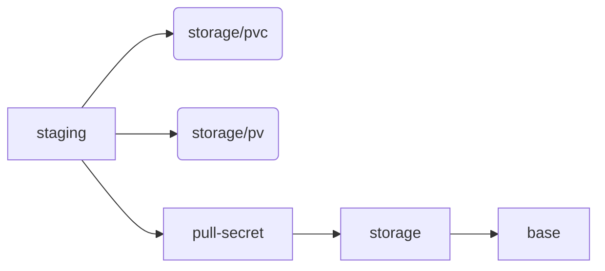

# k8s deployment

This folder is organized in a [base](./base) deployment and some
[overlays](./overlay).

To get started, take [overlays/staging](./overlays/staging) as a
template and fill in the config
([kustimization.yml](./overlays/staging/kustomization.yml), [files/\*](./overlays/staging/files)).
Also depending on whether your cluster supports auto provisioning of
volumes, you need to choose between
[overlays/storage/pvc](./overlays/storage/pvc) (auto provisioning) and
[overlays/storage/pv](./overlays/storage/pv) (manual provisioning) as
a base.

The dependency tree of the overlays looks like:



**Deploy:**

```bash
kubectl apply -k overlays/staging
```

## Minikube

Install it.
Start

```bash
minikube start
```

Enable ingress:

```bash
minikube addons enable ingress
```

```bash
echo "$(minikube ip) portal" > hosts
export HOSTALIASES=hosts
```

(or change `/etc/hosts`)

**Deploy:**

```bash
kubectl apply -k overlays/minikube
```
